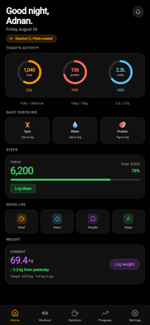
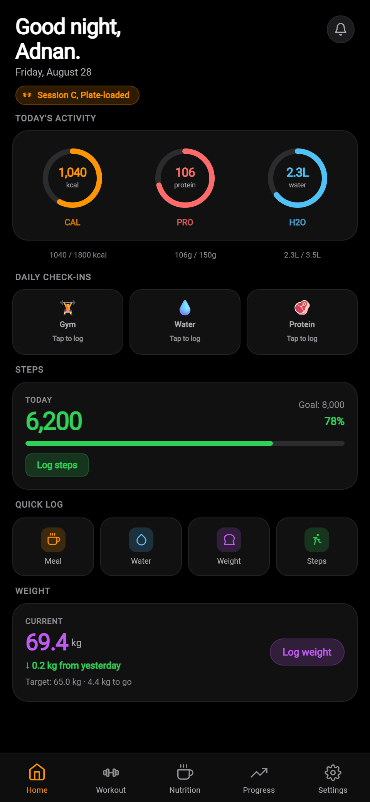
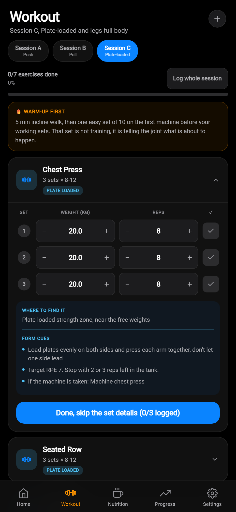
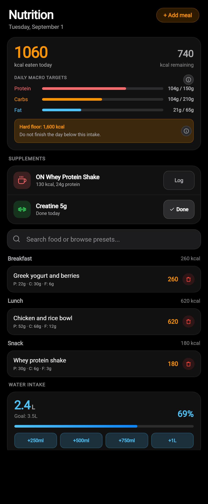
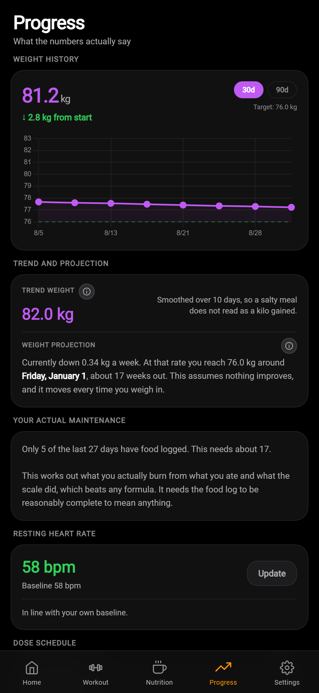
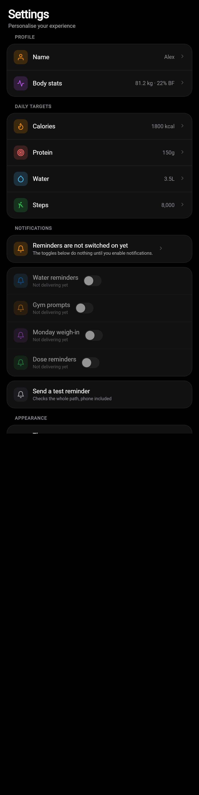
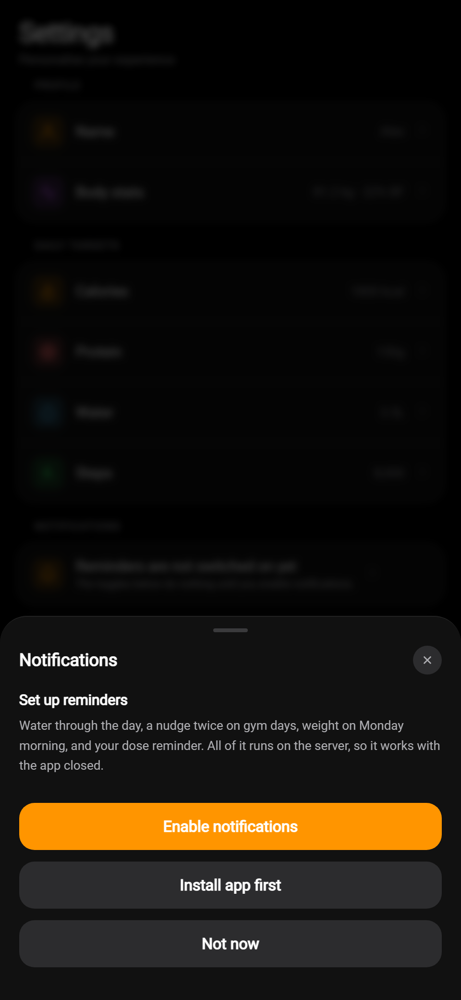

# FitTrack: Free Offline Fitness Tracker PWA

Track workouts, nutrition, weight and a GLP-1 calorie floor with no account, no subscription, and full offline support.

<div align="center">


<br>

**Your data stays on your device. The app stays free.**

One HTML file. No build step, no dependencies, no account, no subscription.
It runs offline, installs to your home screen, and sends you reminders when it is closed.

<br>

[**Open the app**](https://addyrallxx.github.io/fittrack/fittrack.html) &nbsp;·&nbsp;
[How to install](#install-it) &nbsp;·&nbsp;
[Why it exists](#why-i-built-this) &nbsp;·&nbsp;
[How it works](#how-it-works)

<br>



</div>

<br>

## Why I built this

Most fitness apps are built around rigid schedules, calorie ceilings, accounts,
and subscriptions. FitTrack is built around a simpler idea: useful tracking
should adapt to real life and keep your data under your control.

Appetite-suppressing medication can make the calorie **floor** the number that
matters. Most trackers only warn when users approach a ceiling. FitTrack can
warn when intake falls below a chosen floor and provides an optional weekly
GLP-1 dose reminder. It never recommends or calculates a dose.

Most of them want fixed training days. I train three times a week on whichever
three days I can face it. An app that says "it is Wednesday, go to the gym" gets
muted by Thursday, and a muted app sends nothing at all.

Most of them want a subscription for the parts that matter, or an account before
they will let you type your own weight into your own phone.

And every calorie database I checked is full of numbers nobody can source. So
this one shows its work: every food entry carries where its number came from and
how confident that number is, marked `published`, `derived` or `estimate`. If it
was a guess, it says it was a guess.

So I wrote the tracker I wanted: honest about what it does not know, flexible
when plans change, private by default, and free to run.

<br>

## What it does

|  |  |
|---|---|
| **Logs a day in a few taps** | Calories, protein, water, steps, weight, creatine, resting heart rate. Quick-log buttons on the home screen, and home-screen shortcuts so you can add water without opening a screen. |
| **Knows 1,502 foods, and cites them** | Built from real delivery orders and researched data, each entry tagged `published`, `derived` or `estimate`. Falls back to Open Food Facts for anything it does not have. |
| **Three interchangeable sessions** | Full-body workouts named for the actual machines at my gym, with a ramp-in for a detrained body. Any three days a week. Miss one and the plan still works. |
| **Predicts from your own data** | Trend-weight smoothing, TDEE back-calculated from what you logged against what the scale actually did, and a projected date for your target. It refuses to answer when it does not have enough data instead of inventing a number. |
| **Supports GLP-1 routines** | Optional calorie-floor warnings and a weekly dose reminder for people using retatrutide, semaglutide, tirzepatide or another GLP-1. It tracks what you enter without recommending a dose. |
| **Reminds you when it is closed** | Server-scheduled web push, so it works with the app shut. Water checkpoints that skip when you are already ahead, and a gym nudge that stays quiet while you still have a spare day in the week. |
| **Works offline** | Service worker, local-first storage. On a plane, in a basement gym, it still logs. |

<br>
## Screens

<div align="center">
<table>
<tr>
<td align="center" width="33%"><br><sub><b>Home</b><br>Rings, check-ins, quick log</sub></td>
<td align="center" width="33%"><br><sub><b>Workout</b><br>Sets, reps, rest timers</sub></td>
<td align="center" width="33%"><br><sub><b>Nutrition</b><br>Sourced food database</sub></td>
</tr>
<tr>
<td align="center"><br><sub><b>Progress</b><br>Trend weight and projections</sub></td>
<td align="center"><br><sub><b>Settings</b><br>Targets, units, reminders</sub></td>
<td align="center"><br><sub><b>Reminders</b><br>Honest about delivery state</sub></td>
</tr>
</table>
</div>

<br>

## Install it

There is no app store and nothing to pay for. It is a website that installs
itself.

### Android (Chrome)

1. Open **[the app](https://addyrallxx.github.io/fittrack/fittrack.html)** in Chrome.
2. Tap **Install** when Chrome offers it, or use the ⋮ menu and choose **Install app**.
3. Open FitTrack from the new home-screen icon.
4. Go to **Settings, Notifications** and tap **Enable notifications**.

Long-pressing the icon gives you shortcuts straight to water, weight, workout
and food.

### iPhone and iPad (Safari, iOS 16.4 or newer)

1. Open **[the app](https://addyrallxx.github.io/fittrack/fittrack.html)** in Safari.
2. Tap **Share**, then **Add to Home Screen**.
3. **Open it from the new icon**, not from the Safari tab.
4. Go to **Settings, Notifications** and tap **Enable notifications**.

> [!IMPORTANT]
> On iPhone, step 3 is not optional. Safari tabs have no Push API at any iOS
> version, so reminders enabled inside a tab will never arrive. The app detects
> this and tells you, rather than letting you switch on something that cannot
> work.

### Run it yourself

```bash
git clone https://github.com/addyrallxx/fittrack.git
cd fittrack
node serve.mjs
```

Then open http://localhost:8899/fittrack.html.

Serve it over real HTTP. Opening `fittrack.html` as a `file://` URL disables
storage, which makes a perfectly working app look broken.

<br>

## Who it is for

**You will probably like it if** you want to log a day in ten seconds, you train
on no fixed schedule, you want your data in your own browser rather than someone
else's database, and you would rather see "this is an estimate" than a confident
number nobody can source.

**You will probably hate it** if you want social features, a barcode scanner, an
Apple Health or Google Fit sync, or a coach in your pocket. None of that is here.
It is a personal tool that happens to be public, not a product.

It is opinionated in one more way worth stating plainly: it supports someone
using a GLP-1 drug, including warning when intake drops below a floor. If that is
not your situation, that part is simply switched off during onboarding.

<br>
## How it works

```
fittrack.html          the entire app: shell, CSS, and all the JavaScript
sw.js                  service worker: push delivery and offline caching
manifest.json          PWA manifest, icons, home-screen shortcuts
data/foods.json        1,502 foods, each with a source and a confidence
data/workout-program.json
worker/src/index.js    Cloudflare Worker: schedules and sends the reminders
test/                  five suites, 71 counted checks plus syntax and serving smoke checks
```

There is no build step and there are no dependencies. The whole app is one file
you can open, read, and change. Chart.js comes from a CDN and Open Food Facts
fills gaps in the food database. That is the entire supply chain.

### Deliberate choices

<details>
<summary><b>Why one file with inline handlers, in 2026</b></summary>

<br>

Because the alternative buys nothing here. A build step means a toolchain to keep
alive, a `node_modules` to audit, and a compile between me and a fix at 11pm. The
app stays in one readable HTML file. Classic script scope keeps `onclick=` handlers working,
which keeps the markup readable and the debugging obvious.

The cost is real and I will name it: no module boundaries, and testing means
extracting the inline script and running it in a `vm`. That is exactly what
`test/progress.test.mjs` does.

</details>

<details>
<summary><b>Why the service worker is network-first for everything</b></summary>

<br>

In April a cache-first worker pinned a broken build, and the only way out was
uninstalling the app. With no build step there are no hashed filenames, so there
is nothing a cache-first rule could safely match on. The cache exists purely as
an offline fallback. If the network answers at all, the network wins.

One refinement worth noting: only navigation requests fall back to the HTML
shell. Answering a request for `foods.json` with HTML would hand the caller a 200
that passes an `r.ok` check and then reads as an empty food database, which is a
much worse failure than an honest error.

</details>

<details>
<summary><b>Why reminders live on a server instead of in the page</b></summary>

<br>

The app used to arm `setTimeout` callbacks in the page. Those die the moment the
PWA is backgrounded, which is precisely when a reminder matters. A reminder has
to be sent by something awake while you are not looking at your phone.

So a Cloudflare Worker runs every 30 minutes on the free tier, resolves each
user's own wall clock through their IANA timezone, and sends only what is
actually due. Cron triggers are UTC-only, so the Worker does that timezone
resolution itself rather than pretending everyone lives in one place.

The reminders skip themselves when they would be noise. A water checkpoint says
nothing if you are already ahead of it. The gym nudge is arithmetic, sessions
left against days left in the week, and it stays silent while a spare day
remains. Being nagged on a Monday about a target that is still easy is how an app
gets muted.

</details>

<details>
<summary><b>Why the dose reminder refuses to guess</b></summary>

<br>

The titration table is a literal list of confirmed dates and doses, and it stops
dead at the last one. The pattern is obvious, and continuing it would be trivial.
It does not, because naming a number for a research chemical is not a thing a
reminder app gets to do from pattern-matching. Past the last known date it says
it does not know and asks for confirmation.

</details>

<details>
<summary><b>Why every food entry carries a confidence</b></summary>

<br>

Because calorie databases are full of numbers with no provenance, and an
estimate that looks like a fact is worse than an obvious estimate. Entries are
marked `published` when the vendor published the figure, `derived` when it was
computed from published components, and `estimate` when it was reasoned from
comparable items. Independent restaurants are never `published`, because they do
not publish anything.

An adversarial audit of this database caught two pizzas with undeclared pork
sausage, an entry mislabelled as published while sitting below the real figure,
and two salmon entries citing a species not sold in Canada. That is the failure
mode this system exists to catch.

</details>

<br>
## Making notifications actually arrive

This was the hardest part of the project, and almost none of the difficulty is
in sending a push. It is in the ways a push pipeline fails silently, where the
app cheerfully says reminders are on and nothing ever arrives.

Every one of these was a real bug in this repo, found and fixed:

| Failure | What the user saw | What it took |
|---|---|---|
| Browser rotates the subscription while the app is closed | Reminders stop forever | The service worker registers the new subscription itself, keyed on the old endpoint, since a worker cannot read `localStorage` |
| Storage is evicted, so the app generates a new device id | Every reminder arrives **twice** | Registration drops any older record holding the same push endpoint |
| iOS quietly drops the subscription while permission stays granted | Toggle says on, nothing arrives | Opening the app re-subscribes instead of assuming the old one still lives |
| Anything throws while building the notification | Silence on Android, revoked permission on iOS | The build is guarded, with a fallback notification that always shows |
| Permission never granted at all | Four blue toggles implying reminders are running | Toggles now render from real delivery state, not from a stored preference |

That last one is the one I would flag to anyone building this. A settings toggle
that reads from a preference rather than from reality is not a UI detail. It is
the difference between an app that works and an app that lies to you for a week.

<br>

## Testing

No framework, no dependencies, five entry points, 71 counted behavior checks plus syntax and serving smoke checks.

```bash
node test/syntax-check.mjs     # parses the inline script, sw.js, worker, every JSON file
node test/progress.test.mjs    # 28 checks on predictions, dose data, search, theme, and units
node test/push.test.mjs        # 18 checks on the push pipeline's contracts
node test/schedule.test.mjs    # 25 checks on when a reminder fires, and when it stays quiet
node test/serve.test.mjs       # serves the repository and checks every route used by the PWA
```

`syntax-check` exists because a single commit once called functions before they
were defined and took the app to a black screen. It runs before every commit now.

The push suite decodes the VAPID key and asserts it is a 65-byte uncompressed
P-256 point, checks the base64url decoder against known vectors including the
URL-safe alphabet, and asserts that two constants living in two different files
still match. Every one of those failures produces a working-looking app that
never delivers a notification.

> One lesson from this repo worth stealing: 14 passing unit tests once sat
> happily alongside a completely dead HTTP route. The helpers were all correct
> and the endpoint was unreachable because a validation guard ran before it. It
> was found by curling the deployed worker, not by reading the code. Test the
> output, not the source.

<br>

## Privacy

Your data lives in your browser's `localStorage` and nowhere else. There is no
account, no analytics, and no tracking.

The reminder server stores only what the scheduler has to read to decide whether
to stay quiet: a push subscription, a timezone, your reminder preferences, and
four numbers for today (water, whether you trained, sessions this week, whether
you weighed in). It never receives your food log, your weight history, or your
name. There is an export button, and a clear-everything button that means it.

<br>

## Built with

Vanilla JavaScript, HTML and CSS. Chart.js for the graphs. Cloudflare Workers and
KV for the reminder scheduler, using raw Web Crypto for VAPID signing and RFC
8291 payload encryption, verified against the spec's own test vector. Open Food
Facts for foods the local database does not have. GitHub Pages for hosting.

Total running cost: nothing.

<br>

---

<div align="center">
<sub>Built by <a href="https://github.com/addyrallxx">Adnan</a> because the app he wanted did not exist.<br>
If you fork it, set your own targets during onboarding.</sub>

<br><br>

<sub>A personal open source project, not affiliated with or endorsed by any other product or company of a similar name.</sub>
</div>
